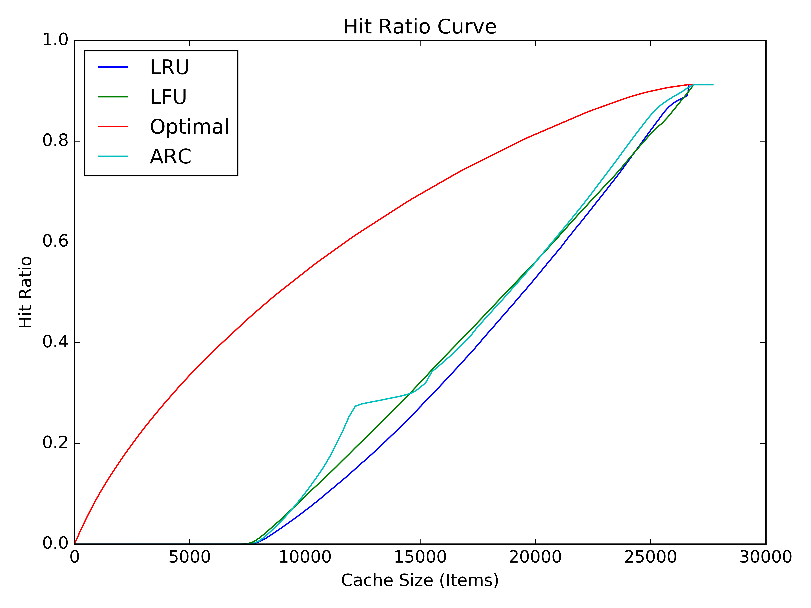
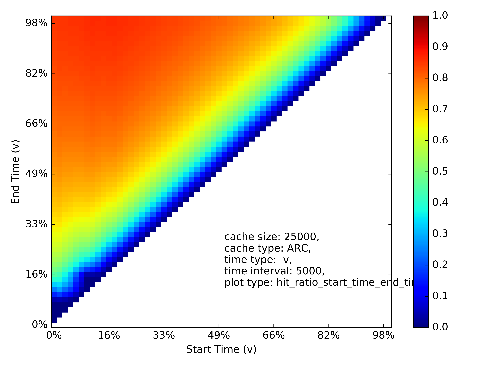

# :maple_leaf: MAPLE: **M**emory **A**ccess **P**rofi**LE**r

MAPLE is a [Pin](https://software.intel.com/en-us/articles/pin-a-dynamic-binary-instrumentation-tool)-based profiler to provide dumping memory access traces of applications at page-level. Currently, it records the _accessed virtual page number_, _timestamp_ and _r/w_. 
> The supported output format is only **csv** at the moment; _binary_ and _vscsi_ will be added soon.

**[1]** Install the [Pin tool](https://software.intel.com/en-us/articles/pin-a-dynamic-binary-instrumentation-tool)  on Linux. [Download](https://software.intel.com/en-us/articles/pin-a-binary-instrumentation-tool-downloads), unpack a kit and change to the directory.

    $ tar zxf pin-3.2-81205-gcc-linux.tar.gz
    $ cd pin-3.2-81205-gcc-linux

**[2]** Clone the __MAPLE!__ :maple_leaf:

    $ git clone https://github.com/0xreza/maple-profiler.git

**[3]** Make the module:

    $ cd maple-profiler
    $ make obj-intel64/maple.so TARGET=intel64

**[4]** Run the experiment:

    $ pin -t obj-intel64/maple.so -- [target_program]

**[5]** Feed your trace into [Mimircache!](http://mimircache.info/). Get insightful heat-maps and hit-ratio curves! 

****

###### Example:

###### _plotted using traces gathered from [PARSEC, streamcluster](http://parsec.cs.princeton.edu) benchmark._

------------------------
### Work in Progress

-   Supporting compact output formats
-   Supporting spatio/temporal sampling 

------------------------
### Credits
Maple is released on public domain under GPLv3, created by [Reza Karimi](http://0xreza.com), PhD student at [SimBioSysLab, Emory University](https://simbiosyslab.github.io/), interning at [INESC-ID, Lisbon]() (Summer 2018)! with invaluable help (and base code) from David Gureya (PhD student at Instituto Superior Técnico), and priceless coaching received from my internship advisor, Joao Barreto.

Contributions and suggestions are welcome!